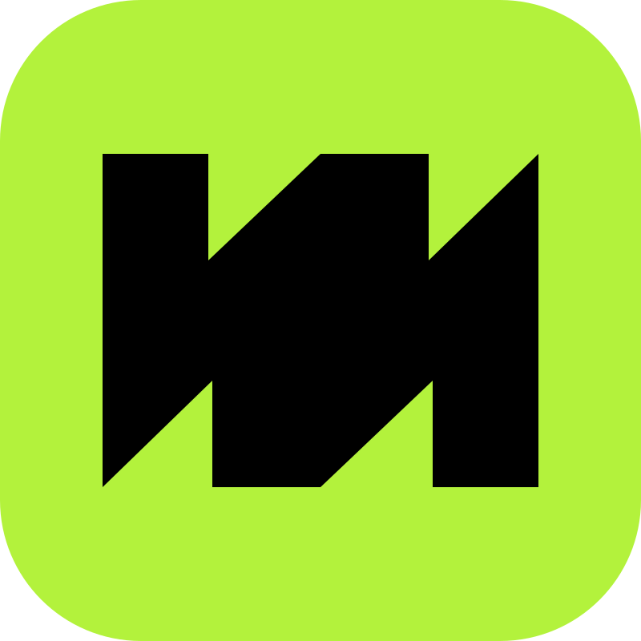

  

<h1 align="center">Monastery</h1>

<b>For the crazy ones.</b> 
A quiet little browser for macOS that gets out of your way, then does your chores.

  <a href="https://github.com/hyperpix/monastery-browser/releases/latest"><b>⬇ Download for Mac</b></a>

---

## What's inside

**🔎 Bangs, everywhere.** Type `!w einstein` or `!gh swift` and skip the search page. Works with any engine you like.

**🎭 Be three people at once.** `@Work gmail.com` opens Gmail signed in as Work, right next to Personal. No more logging out, no more incognito tricks.

**🤖 Ask the page.** The agent reads the page, clicks and types for you, then answers with the exact passage it found. Hit **⌘K** and ask.

**💊 The pill.** Click it on a new tab for widgets, bookmarks, history, downloads and settings. That's the whole menu.

**🙈 The bar hides.** While you read, the toolbar tucks itself away. Point at your tabs, or press **⌘L**, and it comes back.

**🛡 Ads, blocked.** 100,000+ ad and tracker domains, gone before they load.

**🧩 Extensions and Picture in Picture** are in there too, because obviously.

## Install

1. [Download the .dmg](https://github.com/hyperpix/monastery-browser/releases/latest) and drag Monastery into Applications.
2. The first time, **right-click → Open**. (We're not notarized yet. Monastery isn't shady, just new.)
3. Enter your invite code. No code? Ask a friend who has one: every member gets two.

Needs **macOS 26** or later. After that, updates install themselves when you quit.

## FAQ

**Why "Monastery"?** Because the web is loud, and you deserve a quiet place to think.

**Is it Chrome underneath?** Nope. It uses WebKit, the same engine as Safari, so it's light and kind to your battery.

**I found a bug.** Nice. [Open an issue](https://github.com/hyperpix/monastery-browser/issues) and tell us what happened.

---

Here's to the ones who see things differently. 🌿

